# 番茄简谱格式规范

## 注释说明

脚本中，以 `#` 开头的行是注释行，仅方便阅读，无实质作用。

---

## 描述头说明

描述头是由许多行组成，一般写在脚本顶部。每行标记一项简谱或脚本的基本信息，如：标题、副标题、作者、调式等。每一项信息使用"大写字母"作为标识，每个大写字母的意义如下：

| 字母 | 说明 | 示例 | 必须 |
|------|------|------|------|
| V | 版本号 | `V: 1.0` | 是 |
| B | 标题 | `B: 排排坐` | 是 |
| Z | 作者 | `Z: 佚名 词曲` | - |
| D | 调式 | `D: E` | 是 |
| P | 拍号 | `P: 4/4` | 是 |
| J | 节拍 | `J: 6` 或 `J: 欢快的` | - |

### V - 脚本版本号

用来指定当前谱脚本是使用哪个版本的脚本规范，主要是因为后期可能会对脚本规范进行调整，衍生出不同的版本规范。

### B - 曲谱标题

由于一些曲谱有主标题还有附标题，所以 `B` 字段可以多次出现。第一次出现将被认为是主标题，第 2 次以后出现的被认为是附标题。

在番茄简谱软件中，曲谱标题是居中显示的，也可以用来写居中显示的其他文字。

### Z - 作者

由于一般情况下曲谱作者可能有多个，所以 `Z` 字段可以出现多次。

在番茄简谱软件中，作者分别由上到下地居右显示，也可以用来显示列在乐谱右上边的其他文字。

### D - 调式标志

调式必须是一个大写的字母，在字母后面可以加 `#` 或 `$` 表示升降调。

### P - 拍号

使用 `/` 作为分号线，写法如：`P:6/8` 或 `P:4/4`

同时可以指定多个拍号，例如：`P:4/4 2/4`

辅助拍号也可以加上括号，例如：`P:4/4 (2/4 1/4)`

### J - 节拍

节拍可以使用数字或文字表示：
- 数字：软件将识别为每分钟的拍子数
- 文字描述：直接将文字显示在拍号下方位置
- 可以两者并存

---

## 简谱主体

简谱主体仅包含**词**和**曲**两种内容，每行内容对应简谱中的每一行，行开头以 `Q` 或 `C` 定义内容类型：
- `Q` 表示曲
- `C` 表示词

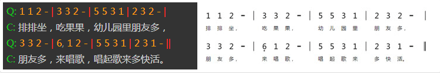

**注意**：主体中的词是依附于上一行的曲的。所以主体应该以 `Q`（曲）开头。而一行曲可以对应多行词。

---

## 音符表示

### 普通音符

普通音符使用 `1-7` 数字表示，对应简谱的"1、2、3、4、5、6、7"这 7 个音符。

增时线使用 `-` 表示。

### 休止符

- **休止符**：使用数字 `0` 表示
- **隐藏休止符**：使用数字 `8` 表示（在谱面上不可见，但是占据相应的空间）

### 节奏音符

节奏音符 `X` 使用数字 `9` 表示。

### 高低音的表示

- **高音**：使用 `'` 表示，跟在数字后面，可以有多个
- **低音**：使用 `,` 表示，跟在数字后面，可以有多个

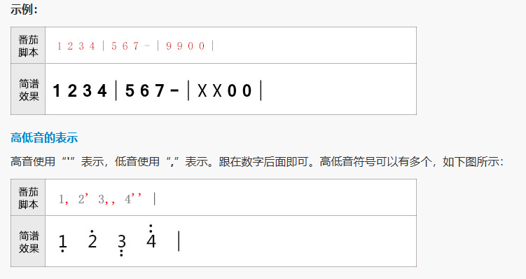

---

## 时值表示

### 增时线

使用 `-` 表示。

### 减时线（时值线）

使用 `/` 表示，跟在音符数字的后面，一个音符可以包含多个。

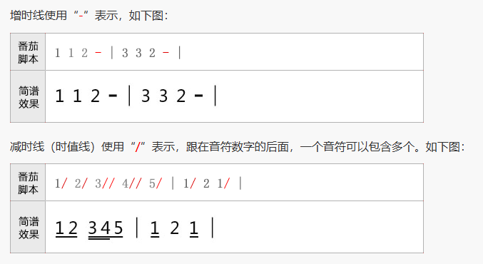

---

## 自定义节拍切分

因为番茄脚本开发初期的失误，导致自动节拍都是以四分音符为一拍进行自动切分的。

因此，导致例如 6/8 和一些特殊情况的节拍切分不能实现。

为了解决此问题，后期增加了 `~` 和 `^` 来协助实现自定义切分节拍：

| 符号 | 作用 |
|------|------|
| `~` | 让前后音符串接在一个节拍中 |
| `^` | 让前后音符强制切开为两个节拍 |

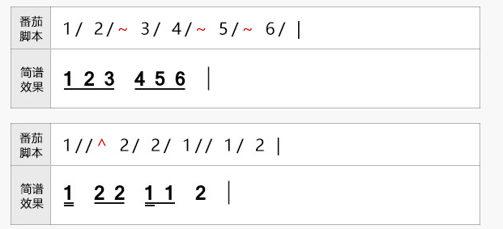

---

## 附点与力度

### 附点音符

- **附点音符**：在音符数字后面加上 `.` 号
- **双附点音符**：加上两个 `..`

### 力度术语

力度术语可以在音符后面加上 `&+缩写字母` 的方式加上，例如 `mp` 写上 `&mp` 即可。

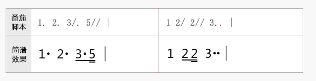

---

## 渐强渐弱符号

- **起点**：使用 `<` 或 `>` 表示
- **终点**：直接使用 `!` 作为结束记号

### 渐强减弱符号与连音线等符号重叠问题

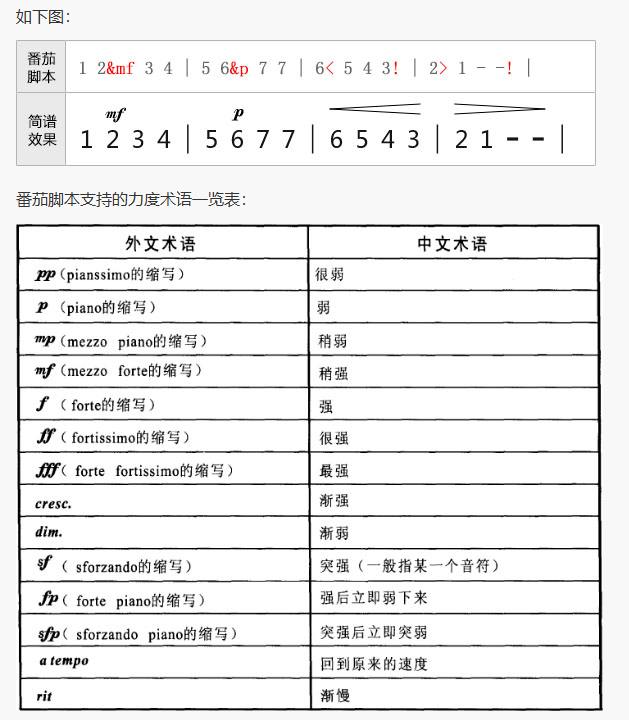

有些时候，渐强减弱符会与连音符重叠，此时可以在渐强减弱符的 `<` 或 `>` 后加上 `+` 号进行调整，`+` 号越多，渐强减弱符越上移。

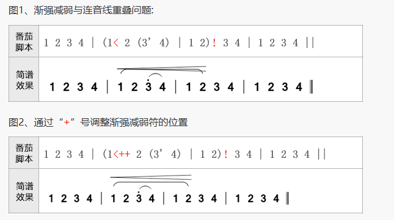

---

## 升降音与还原符号

- **升音符**：使用 `#` 表示
- **降音符**：使用 `$` 表示
- **还原符**：使用 `=` 表示

以上符号均写在音符数字的后方。

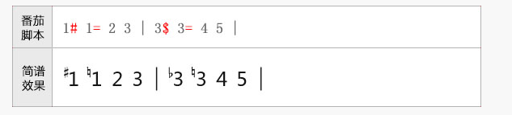

---

## 倚音

### 前倚音

使用中括号 `[]` 包含起来即可，跟在音符数字后即可。`[]` 括号中的音符可以包含：
- 高低音符号 `,` 和 `'`
- 减时线符 `/`
- 升降音符

### 后倚音

使用相同的方法，不同的是要在 `[` 后面加上一个 `h`。

**注意**：倚音里的音符，默认就是 8 分音符，当加了一条减时线后，将变成 16 分音符。

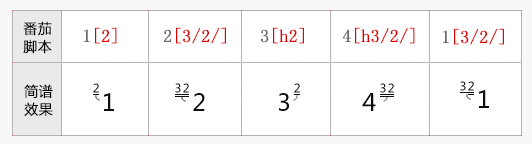

---

## 括号（伴奏部分）

在曲的伴奏部分，一般会使用括号括起来。在番茄脚本中：
- **左括号**：使用 `&zkh` 表示
- **右括号**：使用 `&ykh` 表示

**注意**：不管是左括号还是右括号，均写在音符数字的后面。

---

## 装饰记号

在简谱音符中，有非常多的装饰符号。这些装饰符号在番茄脚本中均一般使用 `&+符号编码` 进行表示。

为了方便记忆，大部分符号的编码是使用符号名称的拼音首字母表示的。常用记号参考下表：

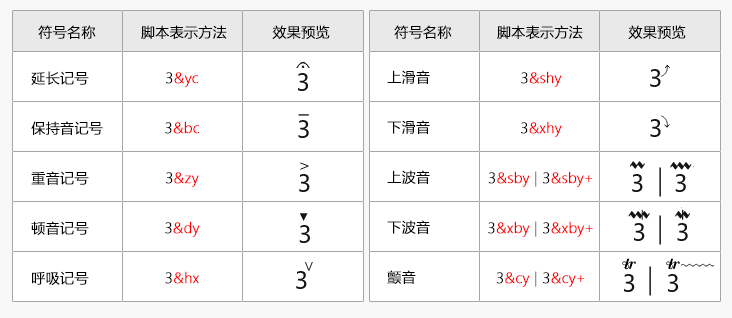

---

## 音符注释

如果某个音符上方需要注释，只需要在音符数字后面将注释使用双引号包含起来即可。

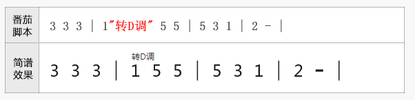

---

## 小节线

各种类型的小节线表示方法：

| 小节线类型 | 表示方法 | 说明 |
|-----------|---------|------|
| 隐藏小节线1 | `|/` | 不显示，不占据排版空间，一般用于每一行的开头 |
| 隐藏小节线2 | `|*` | 不显示，但占用排版空间，一般用于行中间单声部变多声部时 |

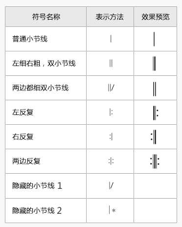

---

## 小节线上的反复记号

以下反复符号只有在小节线处才可以使用：

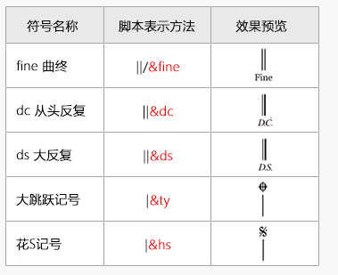

---

## 连音线

需要用连音线连起来的音符，使用 `()` 包含起来即可。

连音线特性：
- 可以嵌套使用
- 支持跨小节
- 支持跨行

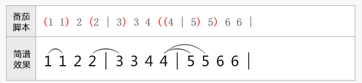

### 跨行连音线

当相同页面中连音线跨行时，请直接在第二行编写右括号即可。

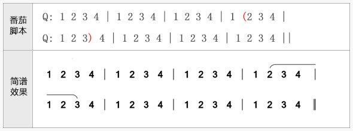

### 切分连音线

有些时候，连音线会被切分。例如跳房子处的连音线和分页处的连音线。此时可以将跳房子的括号写在小节线处。

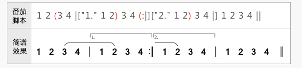

---

## 多连音

连音和多连音的表示方法和连音线差不多，都使用 `()` 包含起来。

不同的是，连音需要在 `(` 后面加上小写字母 `y`。

连音的音符数软件会自动计算。

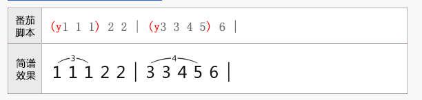

---

## 跳房子

跳房子只能在小节线上标注，使用 `[]` 表示：
- `[` 表示起点
- `]` 表示终点

跳房子线支持跨行。

小节线下的备注信息，则在小节线后使用引号括起来（类似音符备注）即可。

**建议**：为了方便后期导出 MIDI 和软件正确播放，跳房子的备注文字建议使用数字表示。

### 长段落跳房子

当跳房子的段落太长的时候，一般跳房子只需要画到前两个小节，然后右侧无需封闭即可。

此种情况，可以在 `[` 号后面增加 `/` 符即可。

### 跳房子与连音线等重叠问题

有些时候，跳房子默认的高度会与连音符重叠，此时可以在跳房子的 `[` 后加上 `+` 号进行调整，`+` 号越多，跳房子离音符越远。

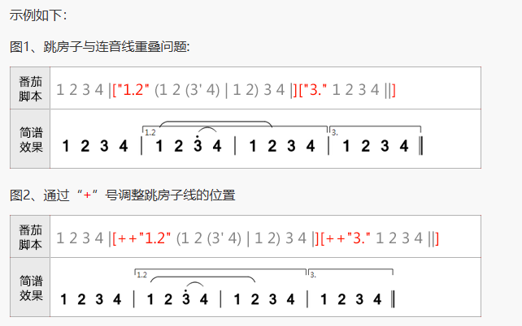

### 行开头处的跳房子

跳房子标记只能写在小节线处，但是有些时候跳房子是从行头开始的，而行头却不应该有小节线。此时可以使用隐藏小节线 `|/` 处理。

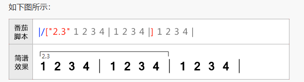

---

## 临时拍号

临时拍号的定义直接写在小节线的备注中（在小节线后面使用引号包含起来），格式是 `p:x/x`。
